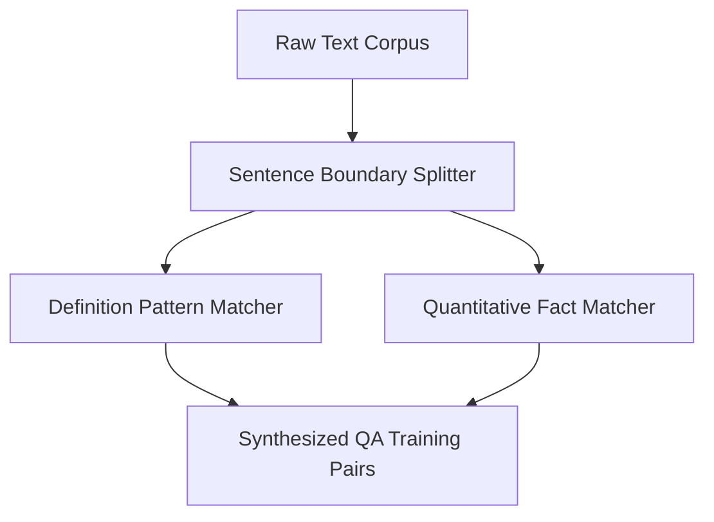

# genpark-synthetic-qa-pair-corpus-extractor-skill

An algorithmic heuristic QA mining engine parsing raw text into high-quality question-answering training pairs for agent knowledge distillation.

## Architecture

## Features
- **Definitional QA Extraction**: Captures concept definitions and entity descriptions.
- **Quantitative Extraction**: Detects statistical, historical, and numerical assertions.
- **Pure Python**: 100% Standard Library.
